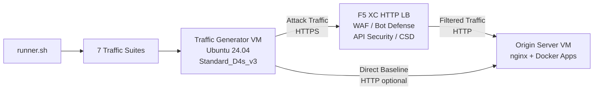

## Purpose

This component provides an automated traffic generation platform that produces attack traffic, reconnaissance scans, bot simulation, and API abuse against an F5 Distributed Cloud HTTP load balancer. It is the "attacker" in a typical demo architecture -- the source of malicious and suspicious traffic that F5 XC security features are designed to detect and block.

In the demo architecture:

```
Traffic Generator VM -> F5 XC HTTP LB (WAF/Bot/API/CSD) -> Origin Server VM
```

The Traffic Generator sends requests to the F5 XC load balancer's public FQDN. The F5 XC platform inspects and filters the traffic before forwarding legitimate requests to the origin server. The operator then reviews the F5 XC security event logs to demonstrate detection and enforcement.

## Architecture



The Traffic Generator VM runs on Azure with:

- **Ubuntu 24.04 LTS** as the base image
- **50+ security tools** installed via cloud-init during provisioning
- **7 organized traffic suites** with numbered scripts executed in order
- **runner.sh** orchestrator for suite execution with results logging
- **config.env** for target configuration (FQDN, origin IP)

## Tool Categories

| Category | Tools | Purpose |
|---|---|---|
| Web Application Testing | nikto, sqlmap, nuclei, dalfox, ffuf, gobuster, feroxbuster, dirb, whatweb | WAF attack payload generation |
| Network Analysis | nmap, masscan, tshark, hping3, tcpdump, netcat, ngrep, iperf3, mtr | Reconnaissance and network probing |
| MITM and Proxy | mitmproxy, socat | Traffic interception and manipulation |
| SSL/TLS Testing | sslscan, sslyze, testssl.sh | TLS configuration scanning |
| Browser Automation | playwright, puppeteer, puppeteer-extra-plugin-stealth | Bot simulation with headless Chrome |
| Subdomain and DNS | subfinder, httpx, amass, dnsrecon, fierce, whois, dnsutils | Reconnaissance and enumeration |
| Credential Testing | hydra, medusa, ncrack | Authentication attack simulation |
| Exploit Frameworks | ZAP, Metasploit (full tier only) | Comprehensive vulnerability scanning |

## Tiered Installation

The Traffic Generator supports two installation tiers controlled by the `install_tier` Terraform variable:

### Standard Tier (default)

Installs all tools listed in the tool catalog except ZAP and Metasploit. Provisioning completes in 15-20 minutes. This tier covers all 7 traffic suites and is sufficient for most demo scenarios.

### Full Tier

Adds OWASP ZAP and Metasploit Framework on top of the standard tier. Provisioning takes approximately 25 minutes. These tools are large (ZAP ~500 MiB, Metasploit ~1 GiB) and are only needed for advanced vulnerability scanning demos.

## Estimated Costs

| Resource | SKU | Estimated Monthly Cost |
|---|---|---|
| Ubuntu 24.04 VM | Standard_D4s_v3 (4 vCPU, 16 GiB) | ~$130 USD |
| Public IP | Standard, Static | ~$4 USD |
| OS Disk | 64 GiB Premium SSD | ~$10 USD |
| VNet + NSG | -- | No additional cost |
| **Total** | | **~$140 USD/month** |

:::tip
Use `terraform destroy` when the lab is not in use to avoid ongoing charges. See [Teardown](../08-teardown/) for the procedure.
:::

## Integration Points

This component integrates with two other demo components:

- **Origin Server** -- The target backend that hosts Juice Shop, DVWA, VAmPI, httpbin, and whoami. The Traffic Generator sends attack traffic through F5 XC to reach these applications. See [Integration](../07-integrate/) for full architecture details.

- **CSD Demo** -- The Client-Side Defense demo application on the origin server. The `javascript-exploits` traffic suite generates Magecart-style script injection payloads that F5 XC Client-Side Defense detects. This validates CSD Phase 2 functionality.

## Modular Component Design

Each lab component is self-contained and deployed independently:

- **Traffic Generator** (this component) provides the attack source
- **Origin Server** provides the vulnerable application targets
- **CDN Simulator** provides the CDN edge caching layer (optional)
- **F5 XC configuration** provides WAF, Bot Defense, API Security, and CSD policies

The human operator or AI assistant adds components one at a time. Deploy the origin server first, configure F5 XC in front of it, then deploy the traffic generator targeting the F5 XC load balancer FQDN.
