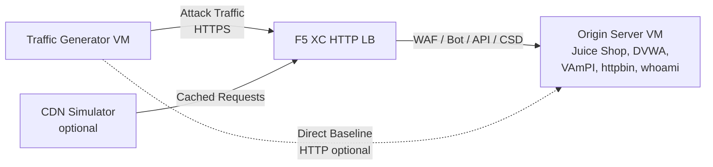

## Full Architecture

The traffic generator is one component in a multi-layer demo environment. The complete architecture when all components are deployed:

```
Traffic Generator -> F5 XC HTTP LB (WAF/Bot/API/CSD) -> Origin Server
                         |
               CDN Simulator (optional)
```



Each component is independently deployed and configured via Terraform. The traffic generator targets the F5 XC load balancer FQDN, not the origin server directly.

## Origin Server Integration

The [origin server](https://f5xc-salesdemos.github.io/origin-server/) provides the backend applications that the traffic generator's attack suites target:

| Traffic Suite | Origin Application | Path |
|---|---|---|
| web-app-attacks | Juice Shop, DVWA | `/juice-shop/`, `/dvwa/` |
| api-attacks | VAmPI | `/vampi/` |
| bot-simulation | All applications | All paths |
| reconnaissance | All applications | All paths |
| ssl-scanning | F5 XC LB (not origin directly) | N/A |
| javascript-exploits | CSD Demo | `/csd-demo/` |
| traffic-generation | All applications | All paths |

### Deployment Order

1. Deploy the **origin server** first -- it provides the backend applications
2. Configure the **F5 XC HTTP load balancer** with the origin server as the origin pool
3. Attach **WAF, Bot Defense, API Security, and CSD policies** to the load balancer
4. Deploy the **traffic generator** with `target_fqdn` set to the F5 XC LB domain

### Targeting Configuration

The traffic generator's `config.env` connects it to the rest of the architecture:

```bash
# Target the F5 XC load balancer (traffic passes through security policies)
TARGET_FQDN=demo.example.com

# Optional: target the origin server directly (bypasses F5 XC)
TARGET_ORIGIN_IP=20.10.5.100
```

When `TARGET_FQDN` is set, all suite scripts send traffic to `https://<TARGET_FQDN>/...`. The F5 XC load balancer receives the requests, applies security policies, and forwards allowed traffic to the origin server.

## CSD Demo Integration

The `javascript-exploits` suite is specifically designed for the Client-Side Defense demo on the origin server. This suite validates CSD Phase 2 functionality:

**Phase 2 flow:**

1. The origin server hosts the CSD demo page at `/csd-demo/`
2. F5 XC CSD injects its monitoring JavaScript into the page
3. The traffic generator's javascript-exploits suite attempts:
   - Injecting inline scripts that mimic Magecart skimmers
   - Modifying DOM elements to redirect form submissions
   - Loading unauthorized third-party JavaScript
4. F5 XC CSD detects these modifications and reports them in the CSD dashboard

To use the javascript-exploits suite:

```bash
# Ensure CSD is enabled on the F5 XC HTTP LB for the /csd-demo/ path
# Then run the suite
/opt/traffic-generator/suites/runner.sh javascript-exploits
```

## CDN Simulator Integration

When the CDN Simulator is deployed, the architecture adds a caching layer:

```
Traffic Generator -> CDN Simulator -> F5 XC HTTP LB -> Origin Server
```

The CDN Simulator sits in front of the F5 XC load balancer, caching responses and adding CDN-like headers. To target traffic through the CDN:

```bash
# Set TARGET_FQDN to the CDN Simulator's endpoint instead of F5 XC directly
TARGET_FQDN=cdn.demo.example.com
```

This is useful for demonstrating how F5 XC handles traffic that arrives through a CDN, including:

- Identifying the true client IP behind CDN proxy headers
- Applying WAF rules to requests that may have been modified by the CDN
- Bot Defense classification when the CDN modifies browser fingerprints

## Direct vs LB Traffic Comparison

The traffic generator supports sending traffic both through F5 XC and directly to the origin. This comparison demonstrates the value of F5 XC security features:

### Through F5 XC (default)

```bash
# Traffic goes: Generator -> F5 XC LB -> Origin
TARGET_FQDN=demo.example.com /opt/traffic-generator/suites/runner.sh web-app-attacks
```

Expected: WAF blocks SQL injection, XSS, and command injection payloads. Security Events dashboard shows blocked requests with violation details.

### Direct to Origin (baseline)

```bash
# Traffic goes: Generator -> Origin (no security layer)
TARGET_FQDN=20.10.5.100 /opt/traffic-generator/suites/runner.sh web-app-attacks
```

Expected: All payloads reach the origin applications unfiltered. Juice Shop and DVWA process the attack payloads. This demonstrates what happens without F5 XC protection.

### Side-by-Side Demo Flow

For a compelling demo, run the same suite both ways:

1. Run `web-app-attacks` directly against the origin -- show that attacks succeed
2. Run `web-app-attacks` through F5 XC -- show that attacks are blocked
3. Open the F5 XC Security Events dashboard to display the blocked requests
4. Compare the suite `meta.json` results: direct runs show more "passed" (attacks succeeded), LB runs show more "failed" (attacks blocked)

```bash
TGEN_IP=$(terraform output -raw public_ip)
ORIGIN_IP="20.10.5.100"
LB_FQDN="demo.example.com"

# Run 1: Direct (baseline)
ssh azureuser@${TGEN_IP} "TARGET_FQDN=${ORIGIN_IP} /opt/traffic-generator/suites/runner.sh web-app-attacks"

# Run 2: Through F5 XC
ssh azureuser@${TGEN_IP} "TARGET_FQDN=${LB_FQDN} /opt/traffic-generator/suites/runner.sh web-app-attacks"

# Compare results
ssh azureuser@${TGEN_IP} 'for d in $(ls -t /opt/traffic-generator/results/ | head -2); do echo "=== $d ==="; cat /opt/traffic-generator/results/$d/meta.json; echo; done'
```

## Multi-Component Terraform Deployment

When deploying the full lab environment, use separate Terraform workspaces or directories for each component:

```bash
# 1. Deploy origin server
cd origin-server
terraform apply -var="subscription_id=YOUR_SUB_ID"
ORIGIN_IP=$(terraform output -raw public_ip)

# 2. Configure F5 XC (manual or via separate Terraform)
# Create origin pool -> HTTP LB -> attach WAF/Bot/API/CSD policies
# LB_FQDN=demo.example.com

# 3. Deploy traffic generator targeting the F5 XC LB
cd ../traffic-generator
terraform apply \
  -var="subscription_id=YOUR_SUB_ID" \
  -var="target_fqdn=demo.example.com" \
  -var="target_origin_ip=${ORIGIN_IP}"

# 4. Generate traffic
TGEN_IP=$(terraform output -raw public_ip)
ssh azureuser@${TGEN_IP} '/opt/traffic-generator/suites/runner.sh web-app-attacks'
```
